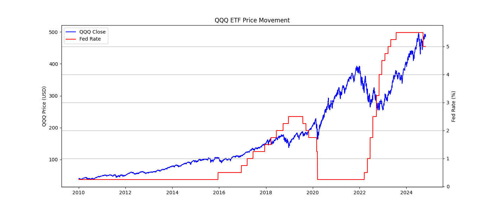
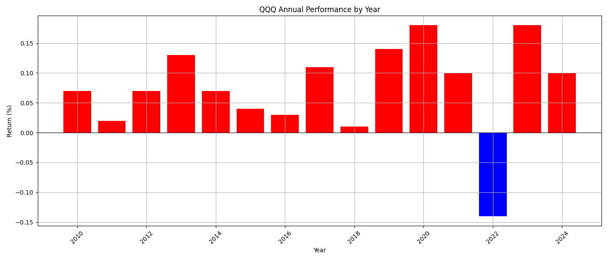
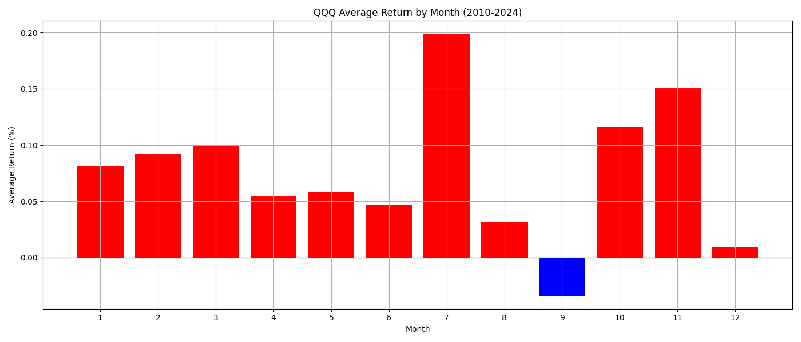
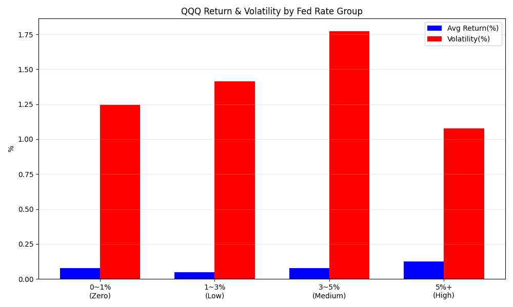
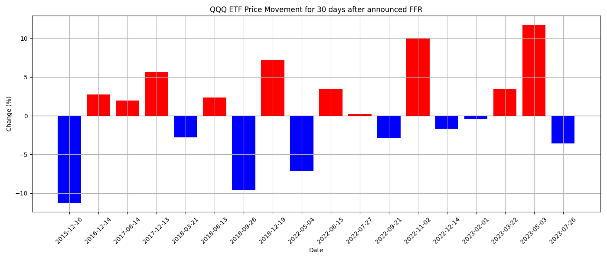
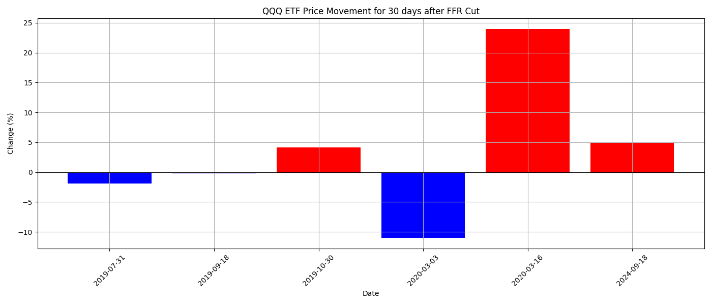

# 금리 사이클과 나스닥100 ETF(QQQ) 수익률 분석

## 프로젝트 개요

미국 연준(Fed)의 기준금리 변화가 나스닥100 ETF(QQQ)의 수익률과 변동성에 어떤 영향을 미치는지 분석한 프로젝트입니다. 2010~2024년 QQQ 일별 시세 데이터와 Fed 금리 변경 이벤트 데이터를 결합하여, 금리 인상/인하/동결 국면별 수익률 차이를 통계적으로 검증했습니다.

- **기간**: 2010-01-04 ~ 2024-10-25 (3,729 거래일)
- **사용 기술**: Python (pandas, matplotlib, scipy), MySQL, PyCharm, GitHub
- **분석 방식**: 동일 분석을 pandas와 SQL 두 가지 방법으로 구현하여 결과 교차 검증

---

## 분석 질문

이 프로젝트는 다음 5가지 질문을 가설(H0/H1) 형태로 세우고 검증하는 방식으로 진행했습니다.

| # | 질문 | H0 | H1 | 검정 방법 | 결과 |
|---|---|---|---|---|---|
| 1 | 금리 인상 후 30일 수익률과 인하 후 30일 수익률은 다른가? | 차이가 없다 | 차이가 있다 | 독립표본 t-test | p=0.594, 유의하지 않음 |
| 2 | 금리 0%대와 5%대 구간에서 QQQ 변동성은 다른가? | 차이가 없다 | 차이가 있다 | Levene's test | p=0.288, 유의하지 않음 |
| 3 | 금리 동결 구간과 변동(인상+인하) 구간의 평균 수익률은 다른가? | 차이가 없다 | 차이가 있다 | 독립표본 t-test | p=0.443, 유의하지 않음 |
| 4 | 월별(1~12월) 평균 수익률에 차이가 있는가? | 차이가 없다 | 차이가 있다 | ANOVA | p=0.711, 유의하지 않음 |
| 5 | 전일 상승/하락과 당일 상승/하락은 관련이 있는가? | 독립이다 | 관련이 있다 | 카이제곱 검정 | p=0.858, 유의하지 않음 |

> 질문 3은 질문 1의 한계(인하 표본 6건, 검정력 부족)를 보완하기 위해 설계했습니다.
>
> 5개 검정이 모두 non-significant로 나온 것 자체가 이 프로젝트의 결론입니다: **금리 단일 변수로는 나스닥 단기 수익률을 유의미하게 설명하기 어렵다.**

---

## 데이터

| 파일 | 설명 |
|---|---|
| `nasdaq.csv` | QQQ ETF 2010~2024 일별 시세 (Open/High/Low/Close/Volume + FedRate) |
| `nasdaq_event_FFR_ver_3.csv` | Fed 기준금리 변경 이벤트(26건)를 거래일 기준으로 매칭한 데이터 |

**전처리**
- 두 데이터의 기준 불일치 해결: 거래일 기준(QQQ) vs 달력 기준(FFR) → 주말/공휴일 제거 및 중복 날짜 처리 후 병합
- 결측치 처리: `ffill()` 적용 후 잔여 결측 0으로 대체
- 파생변수 생성:
  - `daily_return` = (Close − Close.shift(1)) / Close.shift(1) × 100
  - `rate_regime` = 인상(FedRateChange > 0) / 인하(< 0) / 동결(= 0)

> 참고: CSV 원본 파일은 용량 관리를 위해 저장소에 포함하지 않았습니다.

---

## Python 분석 내용

1. **금리-주가 관계 시각화**: `twinx()`를 활용한 QQQ 종가 vs Fed 금리 이중축 차트
2. **연간 수익률**: 2010~2024년 중 2022년만 유일하게 마이너스 수익률
3. **변동성 비교**: 금리 0%대 구간(1.244) vs 5%대 구간(1.075)의 일간 수익률 표준편차 비교
4. **금리 변경 이벤트 윈도우 분석**: 인상/인하 발생일 기준 30일 후 수익률 비교
5. **통계 검증 (질문 1)**: 독립표본 t-test — 인상/인하 후 수익률 차이 (p=0.594)
6. **변동성 통계 검증 (질문 2)**: Levene 검정 — 0%대 vs 5%대 변동성 차이 (p=0.288)
7. **금리 국면별 수익률 비교 (질문 3)**: 동결 vs 변동 구간 t-test (p=0.443)
8. **월별 계절성 분석 (질문 4)**: ANOVA — 1~12월 평균 수익률 차이 (p=0.711)
9. **모멘텀/연속성 분석 (질문 5)**: 카이제곱 검정 — 전일-당일 상승/하락 연관성 (p=0.858)

- 분석 코드: [`Python/pythonProject/nasdaqGP.py`](./Python/pythonProject/nasdaqGP.py)
- 상세 문서: [`Python/README.md`](./Python/README.md)

*




*

---

## SQL 분석

pandas로 수행한 분석 일부를 MySQL로 재현하여 결과 정합성을 교차 검증했습니다.

| 분석 | 주요 기법 | pandas와 비교 |
|---|---|---|
| Q1. 금리 구간별 수익률·변동성 | `LAG()`, `CASE WHEN`, 서브쿼리 + `GROUP BY` | SQL 전용 신규 분석 |
| Q2. 인상/인하 후 30일 수익률 | self-join, 스칼라 서브쿼리로 비거래일 보정 | 인하 평균 +3.33% 일치 |
| Q3. 연도별 수익률·변동성 | `YEAR()` + `GROUP BY` | "2022년 유일 마이너스" 결론 일치 |
| Q4. 금리 변화 시점 감지 | `LAG()`, 사용자 변수(`@var :=`) | 이벤트 테이블 없이 26건 재현 성공 |

- 상세 쿼리·결과·인사이트: [`SQL/README.md`](./SQL/README.md)
- 전체 쿼리 코드: [`SQL/nasdaqGP.sql`](./SQL/nasdaqGP.sql)

---

## 주요 결과 (요약)

- 금리 인하 시기의 평균 30일 수익률(+3.33%)이 인상 시기(+0.45%)보다 높게 나타났으나, 통계적으로 유의미한 차이는 아니었음 (p=0.594)
- 2022년은 15년간 유일한 마이너스 연간 수익률 기록 — 급격한 금리 인상 시기와 일치
- 금리 0%대(변동성 1.244)와 5%대(1.075) 구간의 변동성 차이는 통계적으로 유의미하지 않음 (Levene 검정, p=0.288)
- 금리 동결 구간(평균 0.079%)과 변동 구간(평균 -0.388%)의 평균 수익률 차이도 유의미하지 않음 (p=0.443) — 다만 변동 구간 표본(n=26)이 작아 근본적 한계는 남음
- 월별 평균 수익률은 7월(0.199%)이 최고, 9월(-0.034%)이 유일한 마이너스였으나 ANOVA 결과 유의미한 차이 없음 (p=0.711)
- 데이터 적재 과정에서 테이블 중복 적재(2배)를 구간별 거래일 합계 검증으로 발견·정정 — 상세 내용은 [SQL README의 데이터 정합성 검증 노트](./SQL/README.md#데이터-정합성-검증-노트) 참고

---

## 한계점 및 개선 방향

- 인상/인하 이벤트 표본이 각각 소수(인상 20건, 인하 6건)에 불과해 통계적 검정력이 낮음 → 질문 3(동결 vs 변동)으로 표본 확장 시도
- 상관관계 분석이며 인과관계를 증명하지는 않음 — 금리 구간별 수익률 차이는 해당 시기의 시장 국면(강세장/약세장) 등 교란 변수의 영향일 수 있음
- 나스닥100(QQQ) 단일 지수만 분석 — S&P500, 섹터별 ETF와 비교 시 더 풍부한 해석 가능
- 뉴스/이벤트 텍스트 감정분석 추가 시 금리 발표 영향을 더 정밀하게 측정 가능

---

## 폴더 구조

```
Data_analysis/
├── Python/
│   ├── pythonProject/
│   │   └── nasdaqGP.py        # pandas 분석 + 시각화 + 통계 검정
│   └── README.md              # Python 분석 상세 문서
├── SQL/
│   ├── nasdaqGP.sql           # SQL 분석 쿼리 (Q1~Q4)
│   └── README.md              # SQL 분석 상세 문서
└── README.md                  # 이 파일
```